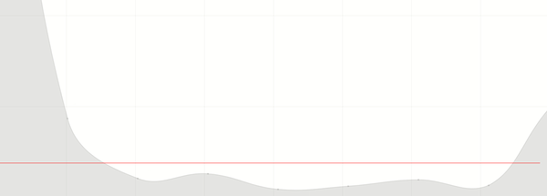

# Live Chart
In this repository you can find all sorts of live charts that stream data from the django backedn with Celery task manager
and show the results in js plotly or Chats.js libraries.

##Install
Install the redis server:
```
sudo apt install redis-server
```


##
Run:
```
redis-server
```
```
celery -A live_charts worker -l info
```
and finally:
```
python manage.py runserver
```

## Examples
The following gives a plotly line graph updated with new random numbers from django backedn using Ajax:
```
127.0.0.1:8000/random_generator/graph
```
The following gives a demo on simple progress bar.
```
127.0.0.1:8000/random_generator/simple_task
```
The following give Chart.js plot update with fetch function from js:
```
127.0.0.1:8000/random_generator/fetch_test
```

the simple_read_async_iss.htm is updating from ISS json data without connection to backend (using fetch)
the updating_dem.html is updating a Chart.js plot without connection to backend using fetch of js.
